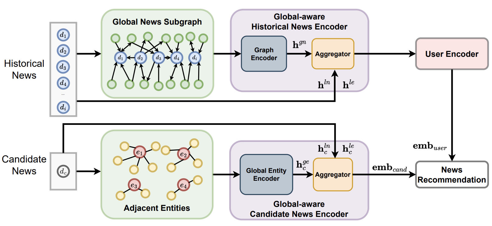

# ✨BeyondGLORY: Global Graph-Enhanced Personalized News Recommendations
This repository enhances the GLORY method introduced in [_Going Beyond Local: Global Graph-Enhanced Personalized News Recommendations_](https://arxiv.org/pdf/2307.06576.pdf) (RecSys 2023) by upgrading its loss function and prediction component. Our modifications aim to optimize performance, achieving improvements in certain cases and closely matching the original results in others. You can find our paper for the enhancements in the [following link](https://github.com/dudi709/BeyondGLORY/blob/main/BeyondGLORY%20Global%20Graph-Enhanced%20Personalized%20News%20Recommendations.pdf).

<p align="center">
  
  <br>
  Original GLORY Model Illustration
</p>


### Environment
> Python 3.8.10
> pytorch 1.13.1+cu117
```shell
cd GLORY

apt install unzip python3.8-venv python3-pip
python3 -m venv venv
source venv/bin/activate
pip install -r requirements.txt
```

```shell
# data download
bash scripts/data_download.sh

# Run
python3 src/main.py model=GLORY data=MINDsmall reprocess=True
```

### Improvements
Our enhancements to the GLORY method concentrate on two critical components:

- **Loss Function:** We've upgraded the existing NCE loss by integrating Pairwise loss. This enhancement can be applied alongside the NCE loss or as a standalone replacement.
- **Prediction Component:** We've replaced the original method's dot product prediction mechanism with a Deep Neural Network (DNN).

The code is configured to run using the original settings by default. To apply our enhancements, you will need to modify the `configs/model/default.yaml` file under the section "Improvements - New Configurations":

```shell
is_new_loss: true # Set to true if you want to use only the Pairwise loss. Must also be true if `is_combined` is set to true.
is_combined: true # Set to true if you want to use the combination of the original NCE loss with the Pairwise loss. Note: `is_new_loss` must be set to true for this configuration to work.
is_ClickNet: true # Set to true if you want to replace the original dot product prediction mechanism with a Deep Neural Network (DNN).
```

* Note: To optimize running times, the code is initially set up for the MINDsmall dataset. To run it on MINDlarge, simply replace instances of 'MINDsmall' with 'MINDlarge' in the code.


